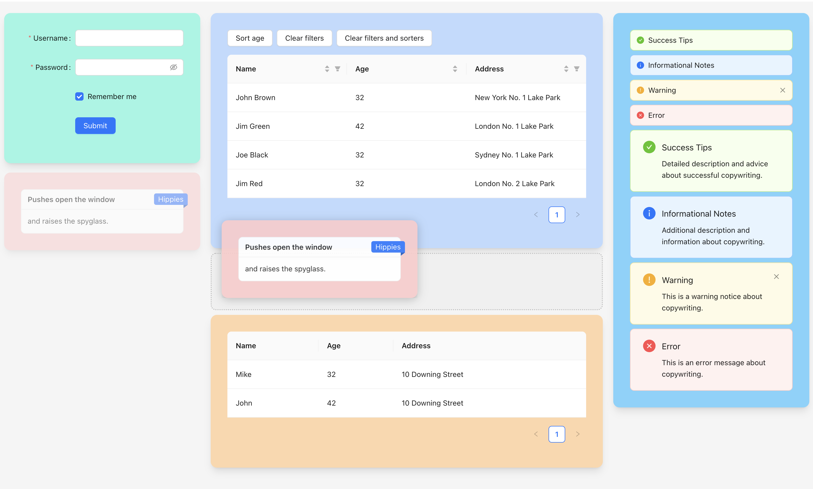

# react-draggable-layout-2

Put your React.js components into a draggable column layout.

This is a new implementation of `react-draggable-layout`.



## Pages

- [npm](https://www.npmjs.com/package/react-draggable-layout-2)
- [github](https://github.com/dsocha/react-draggable-layout-2)

## Install

```bash
yarn add react-draggable-layout-2
```

```bash
npm install --save react-draggable-layout-2
```

## Usage

```jsx
import DraggableLayout2 from "react-draggable-layout-2";

export default function App() {
  const components = [
    { col: 0, id: "Component 1", component: <div style={{ height: "120px", backgroundColor: "rgb(125 211 252)", borderRadius: "1rem", padding: "24px", boxShadow: "0 8px 10px -4px #cccccc" }}>Component #1</div> },
    { col: 0, id: "Component 2", component: <div style={{ height: "180px", backgroundColor: "rgb(153 246 228)", borderRadius: "1rem", padding: "24px", boxShadow: "0 8px 10px -4px #cccccc" }}>Component #2</div> },
    { col: 1, id: "Component 3", component: <div style={{ height: "300px", backgroundColor: "rgb(254 202 202)", borderRadius: "1rem", padding: "24px", boxShadow: "0 8px 10px -4px #cccccc" }}>Component #3</div> },
    { col: 1, id: "Component 4", component: <div style={{ height: "250px", backgroundColor: "rgb(191 219 254)", borderRadius: "1rem", padding: "24px", boxShadow: "0 8px 10px -4px #cccccc" }}>Component #4</div> },
    { col: 2, id: "Component 5", component: <div style={{ height: "180px", backgroundColor: "rgb(254 215 170)", borderRadius: "1rem", padding: "24px", boxShadow: "0 8px 10px -4px #cccccc" }}>Component #5</div> },
  ];

  const handleOnChange = (c) => {
    console.log("onChange()", c);
  };

  return (
    <div style={{ height: "100vh", backgroundColor: "#f4f4f4" }}>
      <DraggableLayout2 defaultComponents={components} columns={3} mainColumnIndex={1} onChange={handleOnChange} />
    </div>
  );
}
```

To exclude controls from being draggable, you can set the className to `draggable-layout-exclude`.

## Properties

- **defaultComponents**
  - An array of components that you want to place into DraggableLayout. Each object must contain following props:
    - **id** - a unique id
    - **col** - an index of column where you want to place your component
    - **component** - a component you want to place
- **onChange**
  - An event that is fired when a user draggs the component to another place.
- **columns**
  - Number of columns in the layout.
- **mainColumnIndex**
  - Index of the main column. The main column is wider than others.
- **isDarkMode**
  - A true/false flag that changes a placeholder styling.
- **hiddenIds**
  - An array of component IDs that you want to hide.
